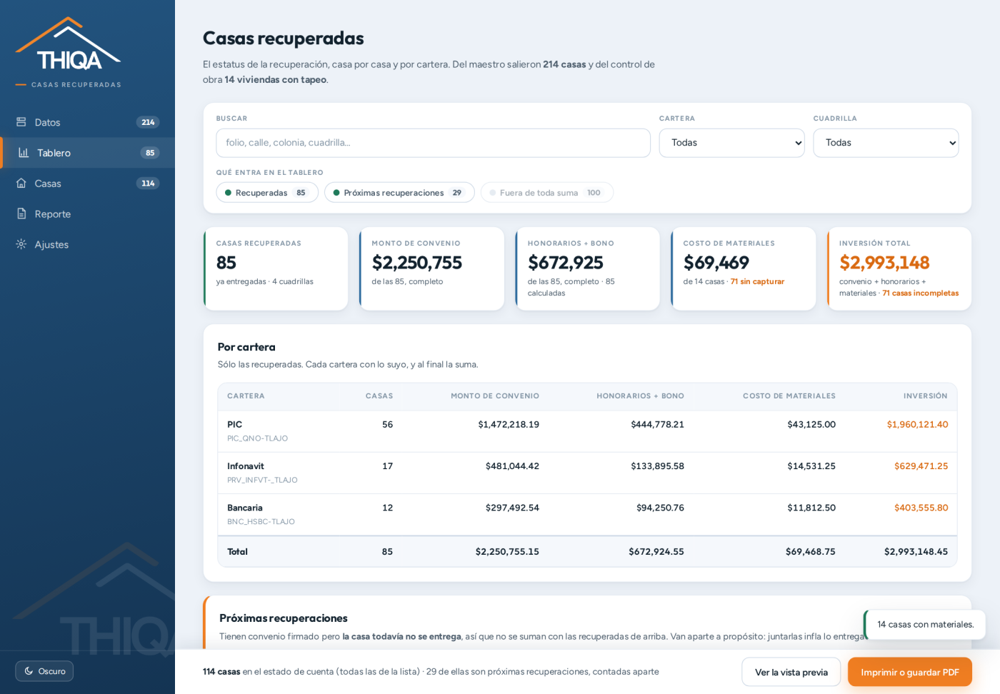
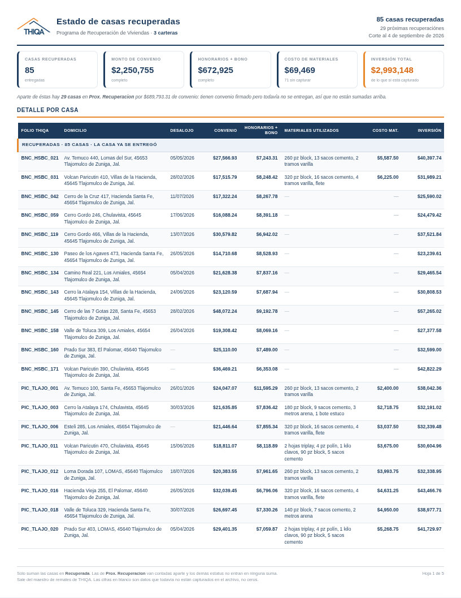
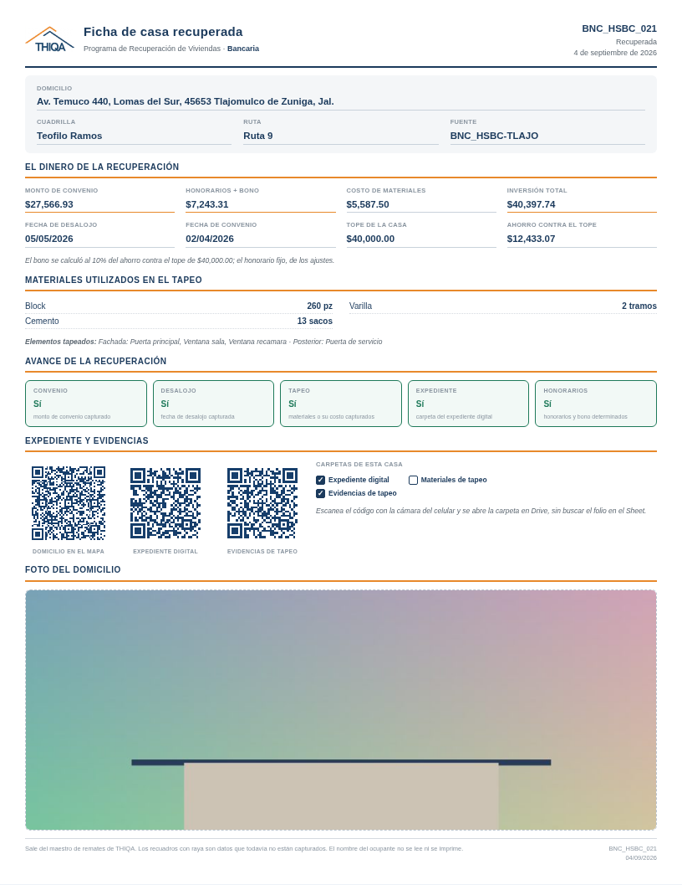

<div align="center">

# 📊 Tablero de Inversionistas THIQA

**El estatus de las casas recuperadas —cartera PIC y cartera Infonavit— directo desde el Excel del maestro. Sin instalar nada.**

[](https://eliasgaribi-ctrl-z.github.io/tablero-inversionistas-thiqa/)


</div>

---

<div align="center">

</div>

## ¿Qué hace?

Este proyecto es una página web que lee el Excel de la **bitácora maestra de remates** y arma el
tablero que un inversionista quiere ver: **cuántas casas se recuperaron, cuáles, cuánto costó cada
una y en qué va cada expediente**. De ahí salen dos documentos para imprimir o guardar como PDF: el
**estado de casas recuperadas** por cartera y la **ficha de una casa**, hoja por hoja.

Es hermano del [Generador de Fichas THIQA](https://github.com/eliasgaribi-ctrl-z/generador-fichas-thiqa)
y comparte su motor: el mismo lector de Excel, el mismo generador de códigos QR y la misma paleta.
La diferencia es para quién está hecho. La ficha de seguimiento es un papel de trabajo, con seis
etapas para firmar en la calle. Esto es un reporte: se lee de arriba para abajo, no se llena, y las
cifras tienen que aguantar que alguien las revise.

No requiere servidor, cuenta ni instalación. **El archivo no sale de tu computadora**: se lee en el
navegador y ahí se queda.

## 🚀 Usar la app

1. Entra a **[eliasgaribi-ctrl-z.github.io/tablero-inversionistas-thiqa](https://eliasgaribi-ctrl-z.github.io/tablero-inversionistas-thiqa/)**
2. Baja el maestro del Sheet con **Archivo → Descargar → Microsoft Excel (.xlsx)** y súbelo.
   Descárgalo, no lo copies a mano: es la descarga la que trae las ligas de las carpetas de Drive
   colgadas de cada celda.
3. Si tienes a mano el **Excel de tapeados** del área de obras, súbelo también. De ahí salen los
   materiales utilizados y su costo — el maestro no los trae.
4. Captura el **honorario fijo** en Ajustes la primera vez. El bono se calcula solo; el honorario
   fijo no se adivina.
5. Mira el **Tablero**, y de ahí a **Reporte** para imprimir o guardar el PDF (`Ctrl/Cmd + P`
   también sirve, y arma lo mismo que el botón).

Hay dos archivos de ejemplo en [`ejemplo/`](ejemplo/) para probar la app sin datos reales.
Los domicilios, los folios y los montos son inventados; lo que sí reproducen es la forma del
archivo verdadero, con sus mañas.

## 📋 Los datos que salen

Por cada casa, lo que le interesa a un inversionista:

| Dato | De dónde sale |
|---|---|
| **Folio THIQA** | columna del folio del maestro |
| **Domicilio (con liga)** | el texto de la columna *Link*, con su liga de Maps viva |
| **Fecha de desalojo** | la fecha de desalojo acordada |
| **Monto de convenio** | el monto acordado con el ocupante |
| **Monto de honorarios + bono** | del archivo si lo trae; si no, se calcula y se dice que se calculó |
| **Materiales utilizados** | del Excel de tapeados, con su unidad (`260 pz`, `13 sacos`) |
| **Costo de materiales** | el gasto de material de ese tapeo |
| **Carpetas del expediente** | expediente digital, materiales de tapeo y evidencias, cada una con su código QR |

Más lo que se deduce de esos datos: la **inversión total** por casa (convenio + honorarios y bono +
materiales) y el **avance**, que son cinco cuadros que se prenden nada más con evidencia en el
archivo.

## ✨ Características

- **Separa PIC de Infonavit sin que se lo digas.** El maestro escribe la cartera con su nombre
  largo —`PIC_QNO-TLAJO`, `PRV_INFVT-_TLAJO`, `CART_SOJI_TLAJO`— y el tablero las agrupa: PIC,
  Infonavit (donde entra también SOJI, que es Soluciones Jurídicas Infonavit), Bancaria y Otras.
  Cuando llegue una cartera nueva va a aparecer sola en Ajustes, con su nombre, y ahí se le dice a
  qué grupo va. **Ninguna cartera se queda fuera de las cuentas sin avisar.**
- **Lee el Excel sin librerías ni internet.** Un `.xlsx` es un ZIP de XML y aquí se abre a mano,
  con lo que ya trae el navegador. Es lo que permite que todo sea un archivo estático.
- **Conserva las ligas del Sheet.** Las carpetas de Drive y los mapas no viven en la celda: cuelgan
  aparte. Se leen de las dos formas en que el Sheet las exporta —hipervínculo de Excel y fórmula
  `=HYPERLINK("…")`, que es la que usa Google cuando la liga se armó con fórmula—.
- **Encuentra sola la hoja y la fila de encabezados** de un libro con varias pestañas, y empata las
  columnas contra los campos del reporte. Lo que no acierte se corrige a mano y se recuerda.
- **Barre el archivo completo, no hasta la primera fila vacía.** En el maestro hay 212 casas
  seguidas y **dos más cientos de renglones abajo**. Cortar en el primer hueco las perdía.
- **Buscador por palabras sueltas** (`cerro 129`), y filtros por cartera y por cuadrilla.
- **Códigos QR de las carpetas**, dibujados aquí mismo. Se escanean con la cámara del celular y
  abren la carpeta en Drive, sin buscar el folio en el Sheet.
- **Foto del domicilio** por casa: se pega con `Ctrl+V`, se arrastra o se elige del disco, y sale
  impresa en su ficha.
- **Copiar la tabla** al portapapeles para pegarla en un correo o en Excel, y **bajar el CSV** con
  punto y coma y BOM, que es lo que Excel en español abre sin preguntar nada.
- **Modo oscuro**, y todo lo que ajustes se recuerda en tu navegador.

## 💰 La regla de dinero, en serio

Es la parte que puede salir caro equivocar, así que está escrita en el código y también impresa en
cada hoja:

> **Sólo suman las casas en Recuperada.** Las de *Prox. Recuperacion* van contadas aparte, y los
> demás estatus no entran en ninguna suma —aunque traigan monto capturado—.

El programa tiene ocho estatus de ruta y sólo dos traen convenio confirmado: *Recuperada* y
*Prox. Recuperacion*. Los otros seis nunca suman. Y aquí se va un paso más lejos que en la regla
original: **recuperada y próxima recuperación tampoco se mezclan entre ellas**. Una casa recuperada
ya se entregó; una próxima todavía no. Sumarlas juntas infla lo entregado, que es exactamente el
número que no se debe inflar frente a un inversionista.

Por eso el tablero y el papel están partidos en bloques, cada bloque cierra con **su** subtotal, y
no existe ningún renglón que junte los dos. Las 100 casas que quedan fuera se dicen con nombre y
número, para que nadie se pregunte dónde quedaron.

### Un cero no es lo mismo que un hueco

Si de 85 casas ninguna trae el costo de materiales capturado, la casilla **no dice `$0.00`**: dice
*sin capturar*. Un cero en un reporte se lee como «no se gastó nada», que es una afirmación
distinta y falsa. Cada cifra de arriba dice de cuántas casas salió y cuántas faltan, y el tablero
lleva una lista de pendientes con el conteo exacto: *8 casas sin fecha de desalojo, 71 sin
materiales*.

### De dónde sale «Honorarios + bono»

Si el Excel trae la columna, se usa tal cual y no se toca nada. Si no la trae —que es como está el
maestro hoy—, se calcula:

```
ahorro = tope de la casa − monto de convenio        (tope: $40,000, o $80,000 con carta poder)
bono   = 10% del ahorro
honorarios + bono = honorario fijo + bono
```

El tope, el porcentaje del bono y el honorario fijo se capturan en **Ajustes**. El honorario fijo
**llega vacío a propósito**: es el único de los tres que no se puede deducir del archivo, y una
cifra inventada en un reporte de inversionistas es peor que un hueco. Mientras esté vacío, la
columna sale como *sin capturar* y el tablero lo dice.

Cuando la cifra se calculó, la hoja impresa lo dice también: *«El bono se calculó al 10% del ahorro
contra el tope de $40,000.00; el honorario fijo, de los ajustes»*. Así cualquiera puede rehacer la
cuenta.

## 🧾 Los dos documentos

<div align="center">


</div>

### Estado de casas recuperadas

El que se le entrega al inversionista. Arriba las cinco cifras —casas, convenio, honorarios y bono,
materiales, inversión total—, abajo la tabla de casas con sus ocho columnas, y al cierre de cada
bloque su subtotal. En el pie va la regla de dinero, para que la hoja se pueda leer sola.

**Se pagina midiendo, no contando renglones.** Un domicilio largo o una lista de materiales de tres
líneas ocupan lo que ocupan; una hoja de tamaño fijo con un número fijo de renglones se desborda o
se queda corta. Aquí se van metiendo renglones hasta que el siguiente ya no cabe, y ése abre la
hoja que sigue. Un encabezado de bloque nunca se queda solo al pie de una hoja.

### Ficha de casa recuperada

Una hoja por casa, para anexar cuando piden ver el detalle de una. Trae el domicilio, el dinero con
su desglose (tope, ahorro, convenio, honorarios y bono, materiales, inversión), la fecha de
desalojo y la de convenio, los materiales con su unidad, los elementos tapeados, los cinco cuadros
del avance, los códigos de las carpetas y la foto del domicilio.

El título cambia según la casa: *Ficha de casa recuperada*, *Ficha de próxima recuperación* o
*Ficha de casa en proceso*. Una casa que todavía no se entrega no se titula como si ya se hubiera
entregado.

Los formatos en blanco, para imprimirlos y llenarlos a mano sin pasar por el Excel, están en
[`plantilla-estado-de-cuenta.html`](plantilla-estado-de-cuenta.html) y
[`plantilla-ficha-de-casa.html`](plantilla-ficha-de-casa.html).

## 📂 Las carpetas y sus códigos

Cada casa tiene su carpeta en Drive, y desde el 13 de agosto de 2026 la columna del **expediente
digital** es la única: ahí van convenios, recibos, expediente escaneado y expediente judicial. El
tablero lee esa columna y también las de **materiales de tapeo** y **evidencias**, si el maestro ya
las trae.

Las tres salen como etiqueta con liga en la tabla, y como **código QR** en la ficha impresa. En
papel una liga no sirve de nada; la idea es escanear con el celular en lugar de ir a buscar el
folio al Sheet.

Y hay una red de seguridad: **cualquier otra columna del archivo que traiga ligas y que no empate
con un campo conocido aparece sola como carpeta extra**. El día que el maestro estrene una columna
de carpetas nueva, se va a ver en el tablero sin tocar una línea de código.

### El QR

Se dibuja dentro del navegador, no con un servicio de imágenes: funciona sin conexión, no le manda
la liga de tu carpeta a nadie, y en el PDF queda dibujado —no es una imagen que se pueda caer—.

Va lo menos apretado posible, que es lo que se lee bien en papel: nivel de corrección L y sin el
`?usp=drive_link` que Drive le cuelga a sus ligas —15 caracteres que no hacen falta para abrir la
carpeta y que brincarían el código de 33×33 módulos a 37×37—.

## 🧱 Los materiales y su costo

El maestro no trae materiales. Vienen del **Excel de tapeados** del área de obras, y ahí no hay
folio: lo único que une las dos tablas es la dirección, y no viene escrita igual —`CERRO LA CRUZ
157 M-1` contra `Cerro de la Cruz 157`—.

Se comparan por número de casa más las palabras de la calle, tirando el relleno (`de`, `la`, `av`)
y la cola que arrastra el domicilio: el C.P. que viene dentro del texto de la liga de Maps y el
dato catastral de la cartera (`NA MZ 17 LT 39 EDIF NA NIV 03`), que traen números que no son el de
la casa. Cuando el número es el mismo y sólo cambia la letra —`178 D` y `178 E`— son dos casas
distintas, que es lo que son.

De ahí salen solos los materiales con su unidad, los elementos tapeados y el gasto. Si una vivienda
trae **tapeo y retapeo** se suman en un solo registro y la ficha lo dice, porque si no el total
impreso no cuadraría con ninguno de los dos.

Del libro entero se busca la pestaña del calendario de obra —no la de los comprobantes de pago, que
también trae la palabra «material»— y la app te dice **de qué hoja salió y cuántas de tus casas
empataron**, para que un cero no pase de noche.

## 📸 La foto del domicilio

No sale del Excel —ahí no hay columna que la traiga— y tampoco se baja de Drive: se le pone desde
la app, en **Casas**. El recuadro acepta la foto de tres maneras, porque casi siempre llega por
WhatsApp: **pégala con `Ctrl+V`**, **arrástrala al recuadro** o **elígela del disco** (o de la
galería, si abres la app en el celular).

Se queda pegada a esa casa, no a la fila del archivo, así que aunque vuelvas a subir el Excel la
semana que entra sigue ahí. Se guarda en tu navegador, ya reducida a 900 px del lado largo —unos
90 KB—, porque el hueco de la hoja mide poco más de tres pulgadas impresas: más resolución no se
nota en papel y sí hace pesado un PDF de ochenta hojas.

Va en IndexedDB y no en `localStorage` a propósito: ochenta y cinco fotos pesan unos siete megas y
`localStorage` se llena a los cinco. Con el tope lleno, guardar truena y se pierde la foto sin
avisar.

## 🔒 Qué no se lee, a propósito

El **nombre del acreditado**, el **número de crédito** y el **expediente judicial** no se leen de
tu archivo. No es que se oculten en el reporte: **no hay campo para ellos**, así que no pueden
salir impresos por accidente ni acabar en el CSV que se manda por correo.

Un inversionista mira casas y cifras, no personas. Y un reporte que circula por correo es
justamente el lugar donde un nombre no debería andar.

## 🛠️ Uso local

```bash
git clone https://github.com/eliasgaribi-ctrl-z/tablero-inversionistas-thiqa.git
cd tablero-inversionistas-thiqa
```

Y abre `index.html` con Chrome o Edge. No hay nada que instalar ni que compilar.

> **Necesita Chrome o Edge** (o cualquier navegador reciente). La parte que descomprime el `.xlsx`
> es `DecompressionStream`, que es lo que hace posible leer Excel sin librerías; si el navegador no
> la trae, la app lo dice al abrirse en lugar de fallar al subir el archivo.

## 🗂️ Qué hay en el repositorio

| Archivo | Qué es |
|---|---|
| `index.html` | la app entera: interfaz, tablero y los dos documentos |
| `nucleo-xlsx.js` | el lector de XLSX/CSV, copiado sin cambios del generador de fichas |
| `qr.js` | el generador de códigos QR, copiado sin cambios del generador de fichas |
| `plantilla-estado-de-cuenta.html` | el estado de cuenta en blanco, para llenar a mano |
| `plantilla-ficha-de-casa.html` | la ficha en blanco, para llenar a mano |
| `ejemplo/` | dos Excel de prueba con datos inventados |
| `fuentes/`, `img/` | las tipografías y la marca, dentro del repositorio para que funcione sin internet |

## 🏗️ Stack

HTML + CSS + JavaScript vanilla. Sin frameworks, sin build step, sin dependencias: el lector de
Excel y el generador de QR están escritos a mano.

---

<div align="center">
<sub>Proyecto interno THIQA · Programa de Recuperación de Viviendas</sub>
</div>
