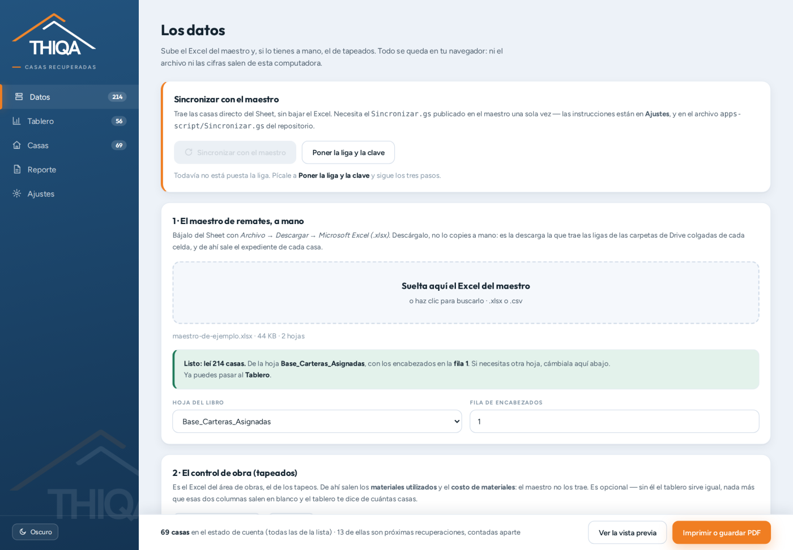

<div align="center">

# 📊 Tablero de Inversionistas THIQA

**El estatus de las casas recuperadas —cartera PIC y cartera Infonavit— directo desde el Excel del maestro. Sin instalar nada.**

[](https://eliasgaribi-ctrl-z.github.io/tablero-inversionistas-thiqa/)


</div>

---

<div align="center">

</div>

## ¿Qué hace?

Este proyecto es una página web que lee el Excel de la **bitácora maestra de remates** y arma el
tablero que un inversionista quiere ver: **cuántas casas se recuperaron, cuáles, cuánto costó cada
una y en qué va cada expediente**. De ahí salen dos documentos para imprimir o guardar como PDF: el
**estado de casas recuperadas** por cartera y la **ficha de una casa**, hoja por hoja.

Es hermano del [Generador de Fichas THIQA](https://github.com/eliasgaribi-ctrl-z/generador-fichas-thiqa)
y comparte su motor: el mismo lector de Excel, el mismo generador de códigos QR y la misma paleta.
La diferencia es para quién está hecho. La ficha de seguimiento es un papel de trabajo, con seis
etapas para firmar en la calle. Esto es un reporte: se lee de arriba para abajo, no se llena, y las
cifras tienen que aguantar que alguien las revise.

No requiere servidor, cuenta ni instalación. **El archivo no sale de tu computadora**: se lee en el
navegador y ahí se queda.

## 🚀 Usar la app

Para el inversionista son dos pasos:

1. Entra a **[eliasgaribi-ctrl-z.github.io/tablero-inversionistas-thiqa](https://eliasgaribi-ctrl-z.github.io/tablero-inversionistas-thiqa/)**
2. Pícale a **Traer las casas del maestro**. Eso es todo: no hay nada que capturar, ni que bajar,
   ni que subir. El botón sirve cuantas veces quieras y cada vez vuelve a leer el maestro tal como
   está en ese momento — la sincronización pasa cuando alguien la pide, no en un horario.

Se abre en el **Resumen**: cuántas casas hay, de qué cartera y en qué va cada una. De ahí,
**Tablero** para las cifras de dinero y **Reporte** para imprimir o guardar el PDF (`Ctrl/Cmd + P`
también sirve, y arma lo mismo que el botón).

Para que ese botón funcione hay que hacer **dos cosas una sola vez en la vida** — no las repite
nadie más después:

- **Publicar la página**, que es lo que hace que el enlace de arriba exista.
  Está en [Publicar la página](#-publicar-la-página).
- **Publicar el script y pegar su liga en `config.js`**, que es lo que hace que el botón traiga
  datos. Está en [Sincronizar con el maestro](#-sincronizar-con-el-maestro).

Dos cosas siguen siendo a mano, y están plegadas en *«¿Prefieres subir los archivos a mano?»*:

- El **Excel de tapeados** del área de obras. Hoy es un respaldo, no un requisito: el maestro ya
  trae el material utilizado, el gasto de material y el gasto de mano de obra en sus últimas
  columnas. El de tapeados sólo se usa para las casas en las que el maestro venga sin capturar.
- El **maestro en `.xlsx`**, por si el script no contesta. Bájalo con **Archivo → Descargar →
  Microsoft Excel (.xlsx)**; descárgalo, no lo copies a mano, porque es la descarga la que trae
  las ligas de las carpetas de Drive colgadas de cada celda.

Y el **honorario fijo** se captura en Ajustes la primera vez: el bono se calcula solo, el honorario
fijo no se adivina.

Hay dos archivos de ejemplo en [`ejemplo/`](ejemplo/) para probar la app sin datos reales.
Los domicilios, los folios y los montos son inventados; lo que sí reproducen es la forma del
archivo verdadero, con sus mañas.

## 🌐 Publicar la página

**Si el enlace de arriba no abre nada, es esto.** Un repositorio con un `index.html` no se publica
solo: GitHub sirve la página sólo cuando se lo pides, y mientras no lo hagas el enlace no existe y
lo único que se ve del proyecto es el código.

Se prende una vez, en el repositorio:

**Settings → Pages → Build and deployment → Source → GitHub Actions**

Con eso, el flujo [`.github/workflows/pages.yml`](.github/workflows/pages.yml) que ya viene en el
repositorio se encarga del resto: cada vez que algo cambie en `main`, vuelve a publicar solo. El
enlace queda en `https://<usuario>.github.io/tablero-inversionistas-thiqa/`, y en **Actions** se ve
cada publicación con su palomita.

> También sirve **Source → Deploy from a branch**, con `main` y la carpeta `/ (root)`. Es el camino
> viejo y funciona igual; el flujo de arriba se prefiere porque deja rastro de cada publicación y
> avisa cuando algo falla, en lugar de fallar en silencio.

El archivo `.nojekyll` que está en la raíz también hace falta y ya está puesto: sin él GitHub
intenta procesar la carpeta con Jekyll y se come los archivos que empiezan con guion bajo.

## 📋 Los datos que salen

Por cada casa, lo que le interesa a un inversionista:

| Dato | De dónde sale |
|---|---|
| **Folio THIQA** | columna del folio del maestro |
| **Domicilio (con liga)** | el texto de la columna *Link*, con su liga de Maps viva |
| **Fecha de desalojo** | la fecha de desalojo acordada |
| **Monto de convenio** | el monto acordado con el ocupante |
| **Monto de honorarios + bono** | las columnas de honorarios y bono del maestro; si vienen vacías, se calcula y se dice que se calculó |
| **Materiales utilizados** | la columna de material utilizado del maestro, con su unidad (`230 blocks`, `4 bultos`) |
| **Gasto de material** | lo que costó el material de ese tapeo |
| **Gasto de mano de obra** | lo que costó la mano de obra de ese tapeo |
| **Carpetas del expediente** | expediente digital, comprobantes y evidencia — con los mismos nombres que trae el maestro, cada una con su botón y su código QR |

Más lo que se deduce de esos datos: la **inversión total** por casa (convenio + honorarios y bono +
material + mano de obra) y el **avance**, que son cinco cuadros que se prenden nada más con
evidencia en el archivo.

## ✨ Características

- **Un botón que trae las casas del maestro**, sin bajar el Excel ni pasar por Drive. Con un
  script publicado una sola vez en el Sheet — y que manda nada más las columnas del tablero.
- **Un resumen de todo el programa**, no sólo de lo recuperado: cuántas casas hay por cartera y
  cuántas van en cada uno de los ocho estatus de ruta del maestro, con su barra de avance.
- **Separa PIC de Infonavit sin que se lo digas.** El maestro escribe la cartera con su nombre
  largo —`PIC_QNO-TLAJO`, `PRV_INFVT-_TLAJO`, `CART_SOJI_TLAJO`— y el tablero las agrupa: PIC,
  Infonavit (donde entra también SOJI, que es Soluciones Jurídicas Infonavit) y Otras. Cuando
  llegue una cartera nueva va a aparecer sola en Ajustes, con su nombre, y ahí se le dice a qué
  grupo va. **Ninguna cartera se queda fuera de las cuentas sin avisar** — y la que se apague a
  propósito sale dicha con su número en el Resumen.
- **Lee el Excel sin librerías ni internet.** Un `.xlsx` es un ZIP de XML y aquí se abre a mano,
  con lo que ya trae el navegador. Es lo que permite que todo sea un archivo estático.
- **Conserva las ligas del Sheet.** Las carpetas de Drive y los mapas no viven en la celda: cuelgan
  aparte. Se leen de las dos formas en que el Sheet las exporta —hipervínculo de Excel y fórmula
  `=HYPERLINK("…")`, que es la que usa Google cuando la liga se armó con fórmula—.
- **Encuentra sola la hoja y la fila de encabezados** de un libro con varias pestañas, y empata las
  columnas contra los campos del reporte. Lo que no acierte se corrige a mano y se recuerda.
- **Barre el archivo completo, no hasta la primera fila vacía.** En el maestro hay 212 casas
  seguidas y **dos más cientos de renglones abajo**. Cortar en el primer hueco las perdía.
- **Buscador por palabras sueltas** (`cerro 129`), y filtros por cartera y por cuadrilla.
- **Códigos QR de las carpetas**, dibujados aquí mismo. Se escanean con la cámara del celular y
  abren la carpeta en Drive, sin buscar el folio en el Sheet.
- **Foto del domicilio** por casa: se pega con `Ctrl+V`, se arrastra o se elige del disco, y sale
  impresa en su ficha.
- **Copiar la tabla** al portapapeles para pegarla en un correo o en Excel, y **bajar el CSV** con
  punto y coma y BOM, que es lo que Excel en español abre sin preguntar nada.
- **Se abre bien en el celular.** Abajo de 720 px la barra lateral azul se convierte en barra de
  pestañas al pie —ahí llega el pulgar— y la marca se queda en un encabezado de un solo renglón.
  Las cifras se acomodan de dos en dos con la inversión total a todo lo ancho, la barra de imprimir
  se parte en dos renglones con botones de 46 px, y en la tabla el folio se queda pegado a la
  izquierda mientras las demás columnas se recorren.
- **La tabla, en dos densidades.** *Cómoda* para proyectar en junta y *Compacta* para revisar de
  cerca; se recuerda en tu navegador. Y un renglón arriba que agrupa las columnas en cuatro
  bloques —Identificación, Desalojo, Dinero, Carpetas y avance— que se queda pegado al hacer
  scroll, para saber siempre en cuál estás parado.
- **Modo oscuro**, y todo lo que ajustes se recuerda en tu navegador.

## 🧭 El resumen del programa

El tablero contesta *«¿cuánto llevamos invertido?»*. El **Resumen** contesta la otra pregunta, la
que trae dirección: *«¿cuántas casas hay, de quién son y en qué van?»*. Es la primera pantalla
después de traer las casas.

Trae seis cifras de un vistazo —casas en el programa, recuperadas, próximas a recuperar, en ruta,
pendientes por asignar y detenidas—, una tabla de **cartera por estatus** donde cada casa cuenta
una sola vez (los renglones suman el total de su cartera, las columnas el total del programa), y
una barra de avance por cartera.

Aquí **sí** entran las casas que no suman dinero. No es una contradicción con la regla del
programa: la regla dice qué se puede sumar en pesos, y en el Resumen no se suman pesos, se cuentan
casas. Por eso también es la única pantalla que **no** respeta los filtros del Tablero — ni la
pestaña de cartera, ni el buscador, ni las casillas de estatus. Un total que cambia según dónde se
quedó el clic no es un total.

Los ocho estatus del catálogo del maestro salen con su nombre: *Recuperada*, *Prox. Recuperacion*,
*En ruta*, *Pendiente por Asignar*, *Negación Ocupante*, *Oposición - 3er Interesado*, *Reciclada*
y *Cartera Bloqueada*. Si el maestro trae uno escrito de otra forma, cae en **Otro estatus** con su
texto tal cual y el Resumen lo dice, en lugar de tragárselo.

### La cartera de Bancarios está apagada

**BNC_HSBC-TLAJO no se muestra.** No tiene pestaña, no entra en ninguna suma y no sale en los
documentos. Está apagada a propósito en [`config.js`](config.js), en la lista `CARTERAS_OCULTAS`,
porque este tablero es de las casas que se recuperan para los inversionistas y esa cartera no va en
ese reporte.

Apagada no es desaparecida: el Resumen dice cuántas casas se dejaron fuera y de qué cartera son, y
el aviso de sincronizar también. Un total al que le faltan casas sin avisar es un total equivocado.

Para volver a prenderla, deja la lista vacía:

```js
CARTERAS_OCULTAS: [],
```

## 🗂️ PIC al frente, Infonavit en su pestaña

El tablero **abre siempre en PIC**. No en la última cartera que viste: abre en PIC, aunque ayer
hayas cerrado la página en Infonavit. La pregunta *«¿de qué cartera son estas cifras?»* no se puede
contestar con *«depende de dónde te quedaste»*, y menos si lo que tienes abierto es un estado de
cuenta que estás por mandar.

Arriba del tablero hay una pestaña por cartera, con su número de casas: **PIC**, **Infonavit**,
las demás que traiga el archivo, y **Todas**. La elección arrastra todo —las cifras de arriba, la
tabla, las fichas y los dos documentos impresos—, así que no hay manera de imprimir un estado de
cuenta de PIC creyendo que es de Infonavit.

Y en cuanto sales de PIC, la pantalla lo dice con letras: *«No estás viendo PIC»*, y de qué es lo
que estás viendo. En **Todas** el aviso avisa lo que de veras importa: que las sumas están juntando
carteras. Los documentos impresos lo llevan en el encabezado —*Cartera PIC*, *Cartera Infonavit*,
o los nombres de las que se juntaron—, para que la hoja se pueda leer sola cuando ya no estés
enfrente.

Infonavit incluye **SOJI** (Soluciones Jurídicas Infonavit, antes CART_DAPA). Si mañana llega una
cartera nueva, aparece con su nombre en Ajustes para decirle a qué grupo va, en lugar de caer en
«Otras» sin que nadie se dé cuenta.

## 🔄 Sincronizar con el maestro

<div align="center">

</div>

Hay un botón que trae las casas directo del Sheet, sin bajar el Excel. Necesita publicar una vez el
archivo [`apps-script/Sincronizar.gs`](apps-script/Sincronizar.gs).

> ### ⚠️ Va en un proyecto aparte, **no** pegado al maestro
>
> El maestro ya tiene su propio Apps Script —el de la página de carga de expedientes— y **ése ya
> define un `doGet`**. Dos `doGet` en el mismo proyecto no conviven: Apps Script se queda con uno y
> el otro deja de existir sin decir nada. Pegar este archivo ahí rompería la página de carga, o
> haría que el tablero nunca reciba datos, y en los dos casos sin un error que lo explique.
>
> Por eso este script entra por su propia puerta y lee el maestro **por su ID**. No necesita estar
> pegado al Sheet; necesita que quien lo publique tenga acceso al Sheet, que es otra cosa.

1. En [script.google.com](https://script.google.com) → **Nuevo proyecto**, firmado con la cuenta
   que tiene acceso al maestro. Le pones de nombre `RMV — Sincronizar tablero` y pegas
   `Sincronizar.gs`.
2. Cambias la `CLAVE` de arriba por una tuya, larga. **Mientras no la cambies el script no contesta
   nada**, a propósito: la de fábrica está escrita en este repositorio y la sabe cualquiera.
3. Corres una vez la función `probar` para **autorizarlo**. Google pide permiso para leer tus hojas
   de cálculo y hay que dárselo; en la pantalla de *«Google no ha verificado esta aplicación»* vas a
   *Configuración avanzada → Ir a (nombre del proyecto)*. Es tu propio script: esa pantalla sale
   siempre con los que uno escribe. Este paso es el que se salta todo el mundo, y sin él la
   implementación contesta una página de inicio de sesión en vez de datos.
4. **Implementar → Nueva implementación → Aplicación web**, con *Ejecutar como: **Yo*** y *Quién
   tiene acceso: **Cualquier usuario***. Copias la dirección que termina en `/exec`.
5. Pegas esa dirección y la clave en [`config.js`](config.js), en `SYNC_URL` y `SYNC_KEY`, y subes
   el archivo. **Ese es el paso que vuelve el tablero un botón:** a partir de ahí nadie más captura
   nada, en ningún navegador.

Después de eso, sincronizar es un clic — y sirve cuantas veces se pida.

> Si prefieres **no** dejar la liga en el repositorio, déjala vacía en `config.js` y pégala en
> **Ajustes** dentro del tablero, donde el botón **Probar la liga** te dice de una vez si funciona
> y cuántas casas ve, sin traerse nada. Lo que cambia es que entonces hay que hacerlo una vez en
> cada navegador que abra la página, y deja de ser un botón para el que llega de fuera. Los pros y
> los contras están escritos completos arriba de `config.js`.

> **Guardar no es publicar.** Si algún día editas el script, hay que hacer *Implementar →
> Administrar implementaciones → editar → **Nueva versión***. Sin eso el tablero sigue recibiendo
> la versión vieja y parece que el cambio no sirvió.

### Por qué hace falta un script y no se lee el Sheet directo

Porque el tablero es una página estática: no tiene servidor ni dónde guardar una contraseña. Las
dos salidas fáciles no sirven:

- La descarga `.../export?format=xlsx` **la bloquea el navegador** (CORS), y además necesita que
  quien la pida esté firmado con una cuenta que tenga acceso al archivo.
- Publicar el Sheet como CSV sí se puede leer, pero **pierde todas las ligas**. Las carpetas de
  Drive no viven en la celda, cuelgan aparte, y son justamente lo que le da valor a esto.

El script resuelve las dos cosas: corre con **tu** permiso —así que el maestro sigue privado— y saca
las URLs de donde de veras están, de las dos formas en que existen (liga de la celda y fórmula
`=HYPERLINK`).

### Qué sale del maestro, y qué no

El script manda **sólo las columnas que el tablero usa**, y están escritas en una lista al
principio del archivo. El **nombre del acreditado**, el **número de crédito**, la **cuenta
predial**, el **juzgado**, el **número de expediente**, el **acreedor** y las **notas** no tienen
renglón en esa lista, así que no salen del Sheet ni por accidente.

Se lee **por nombre de encabezado, no por posición** — a propósito, y es la diferencia importante
contra el otro Apps Script del maestro, el de la página de carga: ése lee por posición y cualquier
columna que se inserte a la izquierda lo descuadra en silencio. Este busca `MONTO ACORDADO` por su
nombre; puedes mover, insertar o borrar columnas y sigue funcionando. Si una columna no aparece, lo
**dice** en lugar de traer el dato equivocado.

**Y cada columna se busca por varios nombres.** El maestro ha renombrado columnas más de una vez:
lo que era `FUENTE` hoy es `CARTERA`, `F. DESALOJO ACORDADA` hoy es `FECHA DESALOJO`, y las
carpetas de tapeo y evidencias hoy son `COMPROBANTES` y `EVIDENCIA`. Con una sola lista rígida,
cualquiera de esos cambios dejaba el tablero mudo — y con el nombre de la cartera perdido, todas
las casas caían en «Sin cartera» y las pestañas de PIC e Infonavit se quedaban vacías. Ahora cada
columna trae el nombre de hoy y el de antes, y sirve con los dos.

Y las fechas salen ya escritas `dd/mm/aaaa` con la zona horaria del Sheet, no como número: JSON no
tiene fechas, y mandarlas en crudo es la receta para que un desalojo del día 1 aparezca el último
día del mes anterior.

### Sobre «Cualquier usuario»

Es la única opción que sirve, porque una página estática no puede firmarse con Google. Eso significa
que **quien tenga la dirección y la clave puede leer esas columnas** — no el Sheet, sólo lo que el
script manda.

Y aquí hay que ser claros, porque es una decisión y no un descuido: **para que el tablero sea un
botón, la dirección y la clave tienen que ir en `config.js`, que es público.** No existe manera de
esconder una contraseña en una página estática; si el inversionista no captura nada, es porque la
página ya la trae. Lo que se puede hacer es que lo que quede expuesto sea lo mínimo, y eso ya está
hecho:

- Del maestro sale **sólo lo que el tablero usa**, nunca datos de personas.
- Conviene revisar que las carpetas de Drive del expediente **no** estén compartidas como
  *«cualquiera con el enlace»*. Con *«sólo personas invitadas»*, la liga le pide iniciar sesión a
  quien no debe estar ahí y no le sirve de nada.
- Si se te sale de las manos: cambias la `CLAVE`, publicas nueva versión y la actualizas en
  `config.js`. La anterior deja de servir en ese momento.

Si esa exposición no te acomoda, deja `SYNC_URL` vacío: el tablero vuelve a pedir la liga una vez
por navegador y nada de esto queda en el repositorio. Es la misma app, con un paso más para quien
la abre.

## 💰 La regla de dinero, en serio

Es la parte que puede salir caro equivocar, así que está escrita en el código y también impresa en
cada hoja:

> **Sólo suman las casas en Recuperada.** Las de *Prox. Recuperacion* van contadas aparte, y los
> demás estatus no entran en ninguna suma —aunque traigan monto capturado—.

El programa tiene ocho estatus de ruta y sólo dos traen convenio confirmado: *Recuperada* y
*Prox. Recuperacion*. Los otros seis nunca suman. Y aquí se va un paso más lejos que en la regla
original: **recuperada y próxima recuperación tampoco se mezclan entre ellas**. Una casa recuperada
ya se entregó; una próxima todavía no. Sumarlas juntas infla lo entregado, que es exactamente el
número que no se debe inflar frente a un inversionista.

Por eso el tablero y el papel están partidos en bloques, cada bloque cierra con **su** subtotal, y
no existe ningún renglón que junte los dos. Las casas que quedan fuera se dicen con nombre y
número, para que nadie se pregunte dónde quedaron — y el [Resumen](#-el-resumen-del-programa) las
cuenta todas, una por una, que para eso está.

### Un cero no es lo mismo que un hueco

Si de las casas recuperadas ninguna trae el costo de materiales capturado, la casilla **no dice
`$0.00`**: dice
*sin capturar*. Un cero en un reporte se lee como «no se gastó nada», que es una afirmación
distinta y falsa. Cada cifra de arriba dice de cuántas casas salió y cuántas faltan, y el tablero
lleva una lista de pendientes con el conteo exacto: *8 casas sin fecha de desalojo, 71 sin
materiales*.

### De dónde sale «Honorarios + bono»

Si el Excel trae la columna, se usa tal cual y no se toca nada. Si no la trae —que es como está el
maestro hoy—, se calcula:

```
ahorro = tope de la casa − monto de convenio        (tope: $40,000, o $80,000 con carta poder)
bono   = 10% del ahorro
honorarios + bono = honorario fijo + bono
```

El tope, el porcentaje del bono y el honorario fijo se capturan en **Ajustes**. El honorario fijo
**llega vacío a propósito**: es el único de los tres que no se puede deducir del archivo, y una
cifra inventada en un reporte de inversionistas es peor que un hueco. Mientras esté vacío, la
columna sale como *sin capturar* y el tablero lo dice.

Cuando la cifra se calculó, la hoja impresa lo dice también: *«El bono se calculó al 10% del ahorro
contra el tope de $40,000.00; el honorario fijo, de los ajustes»*. Así cualquiera puede rehacer la
cuenta.

## 🧾 Los dos documentos

<div align="center">


</div>

### Estado de casas recuperadas

El que se le entrega al inversionista. Arriba las seis cifras —casas, convenio, honorarios y bono,
gasto de material, gasto de mano de obra e inversión total—, abajo la tabla de casas con sus nueve
columnas, y al cierre de cada bloque su subtotal. En el pie va la regla de dinero, para que la hoja
se pueda leer sola.

**Se pagina midiendo, no contando renglones.** Un domicilio largo o una lista de materiales de tres
líneas ocupan lo que ocupan; una hoja de tamaño fijo con un número fijo de renglones se desborda o
se queda corta. Aquí se van metiendo renglones hasta que el siguiente ya no cabe, y ése abre la
hoja que sigue. Un encabezado de bloque nunca se queda solo al pie de una hoja.

### Ficha de casa recuperada

Una hoja por casa, para anexar cuando piden ver el detalle de una. Trae el domicilio, el dinero con
su desglose (tope, ahorro, convenio, honorarios y bono, materiales, inversión), la fecha de
desalojo y la de convenio, los materiales con su unidad, los elementos tapeados, los cinco cuadros
del avance, los códigos de las carpetas y la foto del domicilio.

El título cambia según la casa: *Ficha de casa recuperada*, *Ficha de próxima recuperación* o
*Ficha de casa en proceso*. Una casa que todavía no se entrega no se titula como si ya se hubiera
entregado.

Los formatos en blanco, para imprimirlos y llenarlos a mano sin pasar por el Excel, están en
[`plantilla-estado-de-cuenta.html`](plantilla-estado-de-cuenta.html) y
[`plantilla-ficha-de-casa.html`](plantilla-ficha-de-casa.html).

## 📂 Las carpetas y sus códigos

Cada casa tiene su carpeta en Drive, y desde el 13 de agosto de 2026 la columna del **expediente
digital** es la única: ahí van convenios, recibos, expediente escaneado y expediente judicial. El
tablero lee esa columna y también las de **comprobantes** y **evidencia**, si el maestro ya las
trae capturadas.

Se llaman como se llaman en el maestro: **Expediente digital** (columna B), **Comprobantes**
(columna AL) y **Evidencia** (columna AM). El mismo nombre en el botón, en la etiqueta de la tabla y
en el pie del código, para que nadie tenga que adivinar que son la misma carpeta.

En la ficha de cada casa salen como **tres botones**: el expediente a todo lo ancho, porque es el
que manda, y debajo comprobantes y evidencia. Cuando el maestro no trae la liga el botón se queda
igual pero **punteado en gris**: la casilla existe, lo que falta es capturar la carpeta. En la tabla
van como etiquetas con liga, y en la ficha impresa como **código QR** — en papel una liga no sirve
de nada, y la idea es escanear con el celular en lugar de ir a buscar el folio al Sheet.

> **Las ligas de Comprobantes y Evidencia sólo llegan por dos caminos.** En el maestro esas dos son
> hipervínculo pegado a la celda, no fórmula: el **`.xlsx`** las guarda y el **`.csv` no** — si
> sueltas un CSV, los tres botones salen punteados y el tablero te lo dice ahí mismo, junto a los
> botones. Y por el botón de sincronizar sólo llegan si las dos columnas están en la lista
> **`CON_LIGA`** de [`apps-script/Sincronizar.gs`](apps-script/Sincronizar.gs) — estar en `COLUMNAS`
> no basta: eso manda el texto de la celda, no la carpeta. Después de tocar el script hay que
> publicar una **nueva versión**; guardar no es publicar.

Y hay una red de seguridad: **cualquier otra columna del archivo que traiga ligas y que no empate
con un campo conocido aparece sola como carpeta extra**. El día que el maestro estrene una columna
de carpetas nueva, se va a ver en el tablero sin tocar una línea de código.

### El QR

Se dibuja dentro del navegador, no con un servicio de imágenes: funciona sin conexión, no le manda
la liga de tu carpeta a nadie, y en el PDF queda dibujado —no es una imagen que se pueda caer—.

Va lo menos apretado posible, que es lo que se lee bien en papel: nivel de corrección L y sin el
`?usp=drive_link` que Drive le cuelga a sus ligas —15 caracteres que no hacen falta para abrir la
carpeta y que brincarían el código de 33×33 módulos a 37×37—.

## 🧱 El gasto de obra

**El maestro trae el gasto de obra en sus últimas columnas**, y son dos cifras, no una: el
**gasto de material** y el **gasto de mano de obra**. Las dos entran a la inversión de la casa y
las dos salen por separado en la tabla, en la ficha y en el estado de cuenta — para el
inversionista no es lo mismo el block que el albañil, pero las dos son dinero que salió.

> Durante un tiempo el tablero sólo leyó la primera. La mano de obra no entraba en ninguna suma,
> así que **cada casa se veía más barata de lo que costó**. Ya no.

### El Excel de tapeados, de respaldo

Cuando el maestro venga sin capturar el tapeo de una casa, sigue sirviendo el **Excel de tapeados**
del área de obras. Ahí no hay folio: lo único que une las dos tablas es la dirección, y no viene
escrita igual —`CERRO LA CRUZ 157 M-1` contra `Cerro de la Cruz 157`—.

Se comparan por número de casa más las palabras de la calle, tirando el relleno (`de`, `la`, `av`)
y la cola que arrastra el domicilio: el C.P. que viene dentro del texto de la liga de Maps y el
dato catastral de la cartera (`NA MZ 17 LT 39 EDIF NA NIV 03`), que traen números que no son el de
la casa. Cuando el número es el mismo y sólo cambia la letra —`178 D` y `178 E`— son dos casas
distintas, que es lo que son.

De ahí salen solos los materiales con su unidad, los elementos tapeados y el gasto. Si una vivienda
trae **tapeo y retapeo** se suman en un solo registro y la ficha lo dice, porque si no el total
impreso no cuadraría con ninguno de los dos.

Del libro entero se busca la pestaña del calendario de obra —no la de los comprobantes de pago, que
también trae la palabra «material»— y la app te dice **de qué hoja salió y cuántas de tus casas
empataron**, para que un cero no pase de noche.

## 📸 La foto del domicilio

No sale del Excel —ahí no hay columna que la traiga— y tampoco se baja de Drive: se le pone desde
la app, en **Casas**. El recuadro acepta la foto de tres maneras, porque casi siempre llega por
WhatsApp: **pégala con `Ctrl+V`**, **arrástrala al recuadro** o **elígela del disco** (o de la
galería, si abres la app en el celular).

Se queda pegada a esa casa, no a la fila del archivo, así que aunque vuelvas a subir el Excel la
semana que entra sigue ahí. Se guarda en tu navegador, ya reducida a 900 px del lado largo —unos
90 KB—, porque el hueco de la hoja mide poco más de tres pulgadas impresas: más resolución no se
nota en papel y sí hace pesado un PDF de ochenta hojas.

Va en IndexedDB y no en `localStorage` a propósito: ochenta y cinco fotos pesan unos siete megas y
`localStorage` se llena a los cinco. Con el tope lleno, guardar truena y se pierde la foto sin
avisar.

## 🔒 Qué no se lee, a propósito

El **nombre del acreditado**, el **número de crédito** y el **expediente judicial** no se leen de
tu archivo. No es que se oculten en el reporte: **no hay campo para ellos**, así que no pueden
salir impresos por accidente ni acabar en el CSV que se manda por correo.

Un inversionista mira casas y cifras, no personas. Y un reporte que circula por correo es
justamente el lugar donde un nombre no debería andar.

## 🛠️ Uso local

```bash
git clone https://github.com/eliasgaribi-ctrl-z/tablero-inversionistas-thiqa.git
cd tablero-inversionistas-thiqa
```

Y abre `index.html` con Chrome o Edge. No hay nada que instalar ni que compilar.

> **Necesita Chrome o Edge** (o cualquier navegador reciente). La parte que descomprime el `.xlsx`
> es `DecompressionStream`, que es lo que hace posible leer Excel sin librerías; si el navegador no
> la trae, la app lo dice al abrirse en lugar de fallar al subir el archivo.

## 📦 Qué hay en el repositorio

| Archivo | Qué es |
|---|---|
| `index.html` | la app entera: interfaz, resumen, tablero y los dos documentos |
| `config.js` | **lo único que se toca a mano**: la liga del script, su clave y las carteras apagadas |
| `nucleo-xlsx.js` | el lector de XLSX/CSV, copiado del generador de fichas |
| `qr.js` | el generador de códigos QR, copiado sin cambios del generador de fichas |
| `apps-script/Sincronizar.gs` | el script que le sirve las casas al botón, en su propio proyecto de Apps Script |
| `.github/workflows/pages.yml` | publica la página en GitHub Pages en cada cambio a `main` |
| `.nojekyll` | le dice a GitHub que sirva la carpeta tal cual, sin pasarla por Jekyll |
| `plantilla-estado-de-cuenta.html` | el estado de cuenta en blanco, para llenar a mano |
| `plantilla-ficha-de-casa.html` | la ficha en blanco, para llenar a mano |
| `ejemplo/` | dos Excel de prueba con datos inventados |
| `docs/` | las capturas de pantalla que salen en este README |
| `fuentes/`, `img/` | las tipografías y la marca, dentro del repositorio para que funcione sin internet |

## 🏗️ Stack

HTML + CSS + JavaScript vanilla. Sin frameworks, sin build step, sin dependencias: el lector de
Excel y el generador de QR están escritos a mano.

---

<div align="center">
<sub>Proyecto interno THIQA · Programa de Recuperación de Viviendas</sub>
</div>
